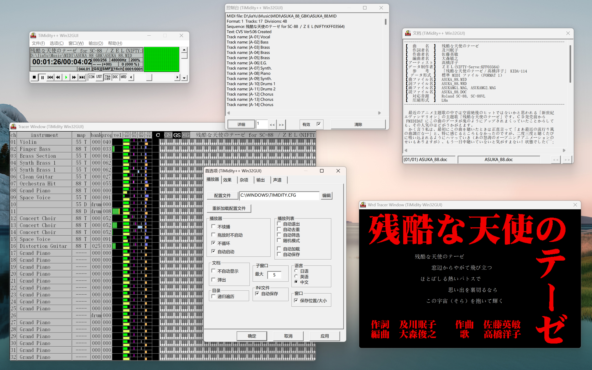

# TiMidity++ Windows 汉化修改版

本仓库为 [TiMidity++](https://timidity.sourceforge.net) 的 Windows 构建版，提供中文界面及全部文档汉化，并修复使用中的一些问题。

## 基本使用

在软件根目录创建 `timidity.cfg` 配置文件，用 `soundfont` 指定音色文件（支持 GUS Patch、SoundFont 2 和独立 PCM 采样），用 `opt` 设置启动参数。具体参考 `timidity.cfg.5.html`（汉化版本位于 `man/zh` 目录）。启动软件时会创建其他 `.ini` 配置文件。

本次构建提供控制台和 GUI 两种使用方式。控制台版本可执行文件为 `timidity.exe`，在终端命令行中使用（可配置环境变量）。默认使用 dumb interface（`-id`），可通过 `-i` 或 `--interface` 参数指定其他控制台界面（支持 ncurses 和 vt100）；可通过 `-O` 或 `--output-mode` 参数指定输出方式。命令行参数参考 `timidity.1.html`（汉化版本位置同上）。

GUI 版可执行文件为 `timw32g.exe`，支持显示 Tracer、DOC、WRD 窗口。

## 修改内容

### 汉化

- 提供汉化界面支持
- 汉化所有内置文档

### 修复叠音

- 修正叠音条件，现在所有情况都允许叠音

### 输出方式

- 添加 PortAudio WASAPI 输出方式
- 为 PortAudio ASIO 添加简单的选项面板
- 添加 MP3 LAME 输出方式并提供选项面板

### 编码

- 修改界面部分源码编码为 GBK，解决中文系统环境下日文字符乱码问题
- 替换 CP936 不支持的字符和未预装的日文字体
- 修改默认设置，现在默认使用中文界面，编码设置为 nocnv
- 修复 DOC、WRD 中仅日文环境下正常显示的问题

### WRD 显示

- 修复 MAG 文件的 r4g4b4 颜色编码被错误解析为 g4r4b4 的问题
- 修复 WRD 命令未完整匹配字符串导致误识别的问题
- 补全 @GCIRCLE() 命令（绘制圆）的未完成代码
- 修复暂停时 WRD 画面提前的问题
- WRD 窗口适应标题栏和边框大小，确保显示区域为 640×400
- 修改默认设置，WRD 窗口默认开始绘制，打开文件时允许后台绘制

## 构建启用

### 控制台界面

- dumb interface `-id`
- ncurses `-in`
- vt100 `-iT`

### 音频输出

- w32 (Windows MMS)

- PortAudio MME / DirectSound / ASIO / + WASAPI (新增)

- Vorbis OGG

- FLAC

- MP3 GOGO

  > 注：Gogo-No-Coda（午後のこ～だ），日本人写的 LAME 分支，是当时最快的 MP3 编码器；现早已停止维护

- \+ MP3 LAME (新增)
